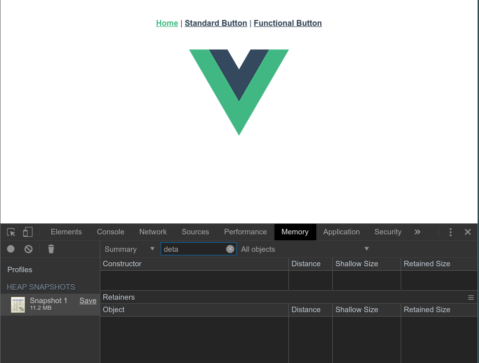
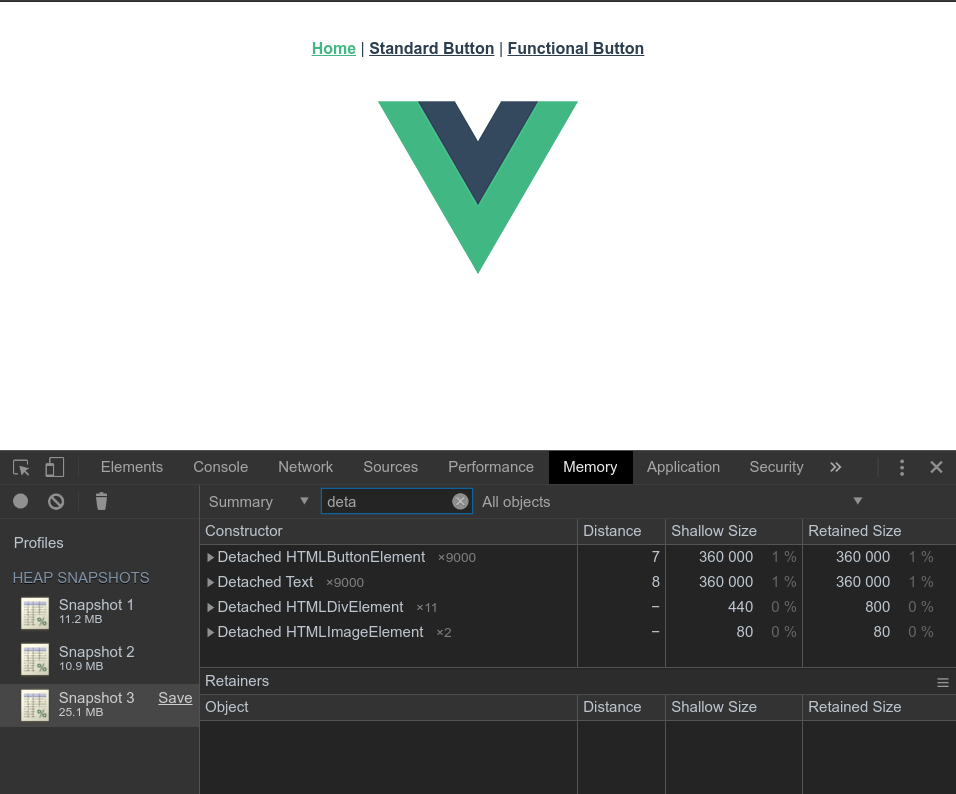

# Memory leak
Each instance of a functional component is "Detached".

1. First memory capture with chrome tool, there is to detached element

2. After some toggle between "Standard Button" route and "Home" route, no more detached element

3. The problem is here, after some toggle between "Functionnal Button" route and "Home",

